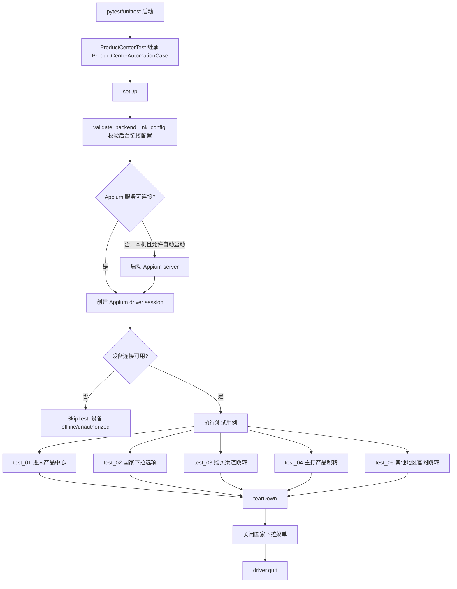
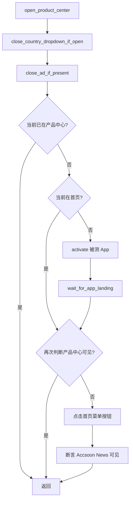
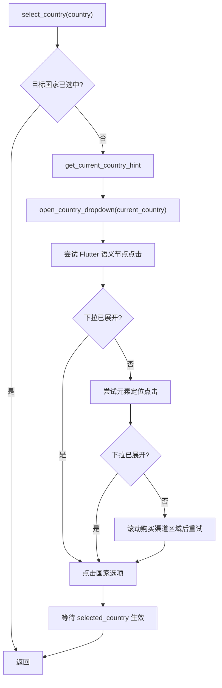
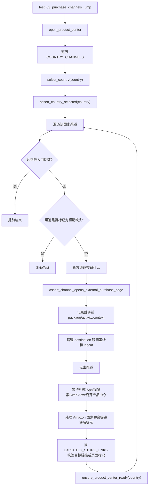
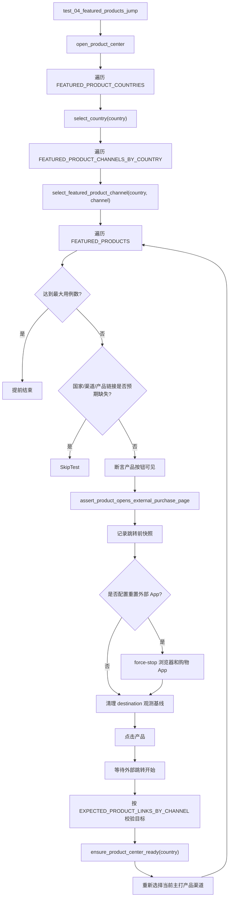
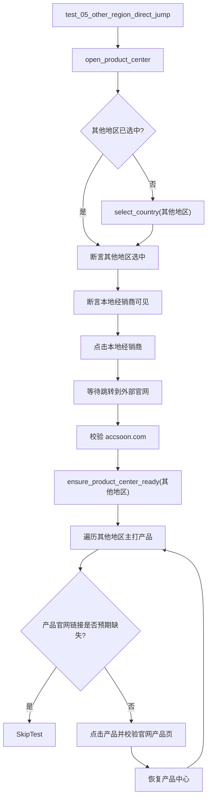
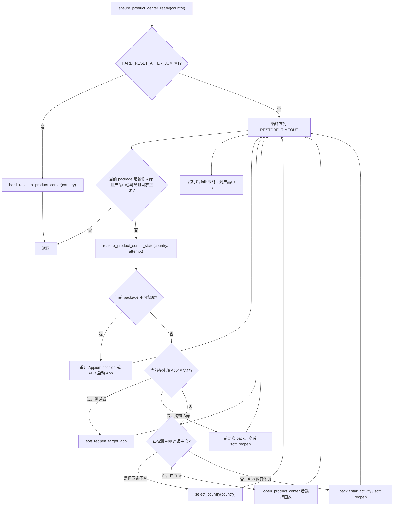
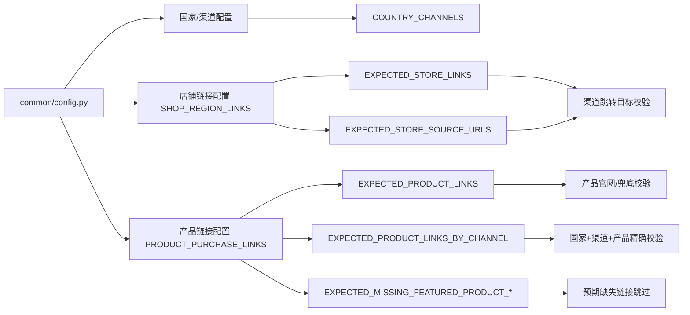

# 产品中心自动化流程图

## 1. 总体测试生命周期

```mermaid
flowchart TD
    A["pytest/unittest 启动"] --> B["ProductCenterTest 继承 ProductCenterAutomationCase"]
    B --> C["setUp"]
    C --> C1["validate_backend_link_config 校验后台链接配置"]
    C1 --> C2{"Appium 服务可连接?"}
    C2 -- "否，本机且允许自动启动" --> C3["启动 Appium server"]
    C2 -- "是" --> C4["创建 Appium driver session"]
    C3 --> C4
    C4 --> C5{"设备连接可用?"}
    C5 -- "否" --> C6["SkipTest: 设备 offline/unauthorized"]
    C5 -- "是" --> D["执行测试用例"]

    D --> D1["test_01 进入产品中心"]
    D --> D2["test_02 国家下拉选项"]
    D --> D3["test_03 购买渠道跳转"]
    D --> D4["test_04 主打产品跳转"]
    D --> D5["test_05 其他地区官网跳转"]

    D1 --> E["tearDown"]
    D2 --> E
    D3 --> E
    D4 --> E
    D5 --> E
    E --> E1["关闭国家下拉菜单"]
    E1 --> E2["driver.quit"]
```

## 2. 进入产品中心

```mermaid
flowchart TD
    A["open_product_center"] --> B["close_country_dropdown_if_open"]
    B --> C["close_ad_if_present"]
    C --> D{"当前已在产品中心?"}
    D -- "是" --> Z["返回"]
    D -- "否" --> E{"当前在首页?"}
    E -- "否" --> F["activate 被测 App"]
    F --> G["wait_for_app_landing"]
    E -- "是" --> H{"再次判断产品中心可见?"}
    G --> H
    H -- "是" --> Z
    H -- "否" --> I["点击首页菜单按钮"]
    I --> J["断言 Accsoon News 可见"]
    J --> Z
```

## 3. 国家/地区选择

```mermaid
flowchart TD
    A["select_country(country)"] --> B{"目标国家已选中?"}
    B -- "是" --> Z["返回"]
    B -- "否" --> C["get_current_country_hint"]
    C --> D["open_country_dropdown(current_country)"]
    D --> D1["尝试 Flutter 语义节点点击"]
    D1 --> D2{"下拉已展开?"}
    D2 -- "否" --> D3["尝试元素定位点击"]
    D3 --> D4{"下拉已展开?"}
    D4 -- "否" --> D5["滚动购买渠道区域后重试"]
    D2 -- "是" --> E["点击国家选项"]
    D4 -- "是" --> E
    D5 --> E
    E --> F["等待 selected_country 生效"]
    F --> Z
```

## 4. 购买渠道跳转

```mermaid
flowchart TD
    A["test_03_purchase_channels_jump"] --> B["open_product_center"]
    B --> C["遍历 COUNTRY_CHANNELS"]
    C --> D["select_country(country)"]
    D --> E["assert_country_selected(country)"]
    E --> F["遍历该国家渠道"]
    F --> G{"达到最大用例数?"}
    G -- "是" --> Z["提前结束"]
    G -- "否" --> H{"渠道是否标记为预期缺失?"}
    H -- "是" --> I["SkipTest"]
    H -- "否" --> J["断言渠道按钮可见"]
    J --> K["assert_channel_opens_external_purchase_page"]
    K --> K1["记录跳转前 package/activity/context"]
    K1 --> K2["清理 destination 观测基线和 logcat"]
    K2 --> K3["点击渠道"]
    K3 --> K4["等待外部 App/浏览器/WebView/离开产品中心"]
    K4 --> K5["处理 Amazon 国家弹窗等跳转后提示"]
    K5 --> K6["按 EXPECTED_STORE_LINKS 校验目标链接或页面标识"]
    K6 --> L["ensure_product_center_ready(country)"]
    L --> F
```

## 5. 主打产品跳转

```mermaid
flowchart TD
    A["test_04_featured_products_jump"] --> B["open_product_center"]
    B --> C["遍历 FEATURED_PRODUCT_COUNTRIES"]
    C --> D["select_country(country)"]
    D --> E["遍历 FEATURED_PRODUCT_CHANNELS_BY_COUNTRY"]
    E --> F["select_featured_product_channel(country, channel)"]
    F --> G["遍历 FEATURED_PRODUCTS"]
    G --> H{"达到最大用例数?"}
    H -- "是" --> Z["提前结束"]
    H -- "否" --> I{"国家/渠道/产品链接是否预期缺失?"}
    I -- "是" --> J["SkipTest"]
    I -- "否" --> K["断言产品按钮可见"]
    K --> L["assert_product_opens_external_purchase_page"]
    L --> L1["记录跳转前快照"]
    L1 --> L2{"是否配置重置外部 App?"}
    L2 -- "是" --> L3["force-stop 浏览器和购物 App"]
    L2 -- "否" --> L4["清理 destination 观测基线"]
    L3 --> L4
    L4 --> L5["点击产品"]
    L5 --> L6["等待外部跳转开始"]
    L6 --> L7["按 EXPECTED_PRODUCT_LINKS_BY_CHANNEL 校验目标"]
    L7 --> M["ensure_product_center_ready(country)"]
    M --> N["重新选择当前主打产品渠道"]
    N --> G
```

## 6. 其他地区官网跳转

```mermaid
flowchart TD
    A["test_05_other_region_direct_jump"] --> B["open_product_center"]
    B --> C{"其他地区已选中?"}
    C -- "否" --> D["select_country(其他地区)"]
    C -- "是" --> E["断言其他地区选中"]
    D --> E
    E --> F["断言本地经销商可见"]
    F --> G["点击本地经销商"]
    G --> H["等待跳转到外部官网"]
    H --> I["校验 accsoon.com"]
    I --> J["ensure_product_center_ready(其他地区)"]
    J --> K["遍历其他地区主打产品"]
    K --> L{"产品官网链接是否预期缺失?"}
    L -- "是" --> M["SkipTest"]
    L -- "否" --> N["点击产品并校验官网产品页"]
    N --> O["恢复产品中心"]
    O --> K
```

## 7. 跳转后恢复

```mermaid
flowchart TD
    A["ensure_product_center_ready(country)"] --> B{"HARD_RESET_AFTER_JUMP=1?"}
    B -- "是" --> C["hard_reset_to_product_center(country)"]
    C --> Z["返回"]

    B -- "否" --> D["循环直到 RESTORE_TIMEOUT"]
    D --> E{"当前 package 是被测 App 且产品中心可见且国家正确?"}
    E -- "是" --> Z
    E -- "否" --> F["restore_product_center_state(country, attempt)"]
    F --> G{"当前 package 不可获取?"}
    G -- "是" --> G1["重建 Appium session 或 ADB 启动 App"]
    G -- "否" --> H{"当前在外部 App/浏览器?"}
    H -- "是，浏览器" --> H1["soft_reopen_target_app"]
    H -- "是，购物 App" --> H2["前两次 back，之后 soft_reopen"]
    H -- "否" --> I{"在被测 App 产品中心?"}
    I -- "是但国家不对" --> I1["select_country(country)"]
    I -- "否，在首页" --> I2["open_product_center 后选择国家"]
    I -- "否，App 内其他页" --> I3["back / start activity / soft reopen"]
    G1 --> D
    H1 --> D
    H2 --> D
    I1 --> D
    I2 --> D
    I3 --> D
    D --> Y["超时后 fail: 未能回到产品中心"]
```

## 8. 配置驱动关系

```mermaid
flowchart LR
    A["common/config.py"] --> B["国家/渠道配置"]
    A --> C["店铺链接配置 SHOP_REGION_LINKS"]
    A --> D["产品链接配置 PRODUCT_PURCHASE_LINKS"]
    B --> E["COUNTRY_CHANNELS"]
    C --> F["EXPECTED_STORE_LINKS"]
    C --> G["EXPECTED_STORE_SOURCE_URLS"]
    D --> H["EXPECTED_PRODUCT_LINKS"]
    D --> I["EXPECTED_PRODUCT_LINKS_BY_CHANNEL"]
    D --> J["EXPECTED_MISSING_FEATURED_PRODUCT_*"]
    F --> K["渠道跳转目标校验"]
    G --> K
    H --> L["产品官网/兜底校验"]
    I --> M["国家+渠道+产品精确校验"]
    J --> N["预期缺失链接跳过"]
```
